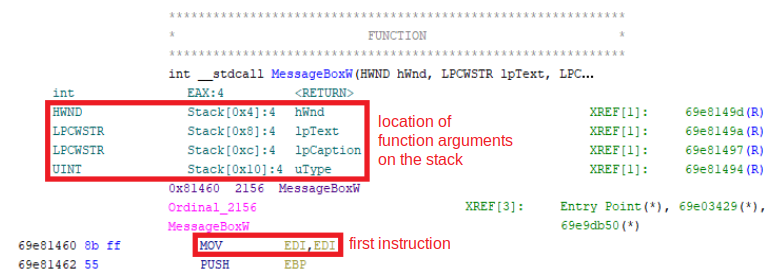
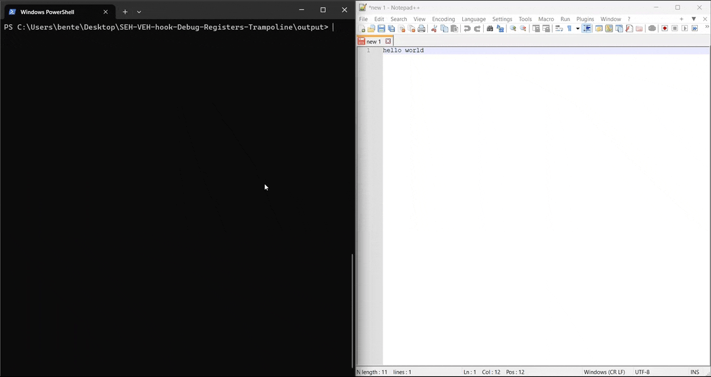

# Structered/Vectored Exception Handler hook

A demo of a Structured or Vectored Exception Handler (SEH/VEH) hook using Debug Registers to trigger the exception and recovering with an assembly trampoline.

## Structured/Vectored Exception Handler

Structured Exception Handling (SEH) is a mechanism for handling both hardware and software exceptions.
This enables applications to have complete control over the handling of exceptions and provides support for debuggers.
Vectored Exception Handling is an extension to Structured Exception Handling.

When an exception is raised, a list of ExceptionFilters will be traversed until a handler for that particular exception is found.
Once the ExceptionFilter is finished handling the exception, it can return control to the rest of the application.

## SEH/VEH hook

To install a SEH hook, we will first inject the DLL in this project using a [DLL injector](https://github.com/BenteVE/DLL-Injector).
This DLL contains a trampoline function, an ExceptionFilter and an installation function.

To install the hook, we can use `SetUnhandledExceptionFilter` for an SEH hook or `SetVectoredExceptionHandler` for a VEH hook.
In both cases, the ExceptionFilter can be the same.

Inside the ExceptionFilter, we can use the `ContextRecord` to view the function parameters and modify them on the stack.

In this implementation we trigger the exception by using the [X86 debug registers](https://en.wikipedia.org/wiki/X86_debug_register) to set a breakpoint at the first byte of the target function implementation.

Once the ExceptionFilter is done, we need to skip the first byte of the function to avoid an infinite loop.
In this implementation we will use a trampoline function that executes the first assembly instruction that was overwritten, and then jumps the second instruction of the original function.
We can find the first instruction with a decompiler like [Ghidra](https://github.com/NationalSecurityAgency/ghidra).
Alternatively, it is also possible to copy the instruction into the trampoline before overwriting it.



The triggering and recovering from the exceptions can be accomplished in multiple different ways.
For some alternative implementations of a SEH/VEH hook, you can view:

- [SEH/VEH hook triggering exception with INT3 opcode](https://github.com/BenteVE/SEH-VEH-hook-INT3-opcode)
- [SEH/VEH hook using Page Guard exceptions](https://github.com/BenteVE/SEH-VEH-hook-Page-Guard-Exception)

## Demo

In this particular implementation, we will hook the `MessageBoxW` function in the `user32.dll`.
The ExceptionFilter will modify the function arguments on the stack to replace the title.

1. Clone the repository:

    ```bash
    git clone https://github.com/BenteVE/SEH-VEH-hook-Debug-Registers-Breakpoint.git
    ```

2. Build the DLL for the desired architecture (x86) using Visual Studio.
   The architecture of the DLL should match the architecture of the target program and the used DLL injector.

3. Use a DLL injector to inject the built DLL into the target process.
   The injector used here is available in another [repository](https://github.com/BenteVE/DLL-Injector) with a detailed explanation.

4. Trigger an action that uses a `MessageBox` in the target program to verify that the hook worked.
   For Notepad++, attempting to close an unsaved file does this:

    
